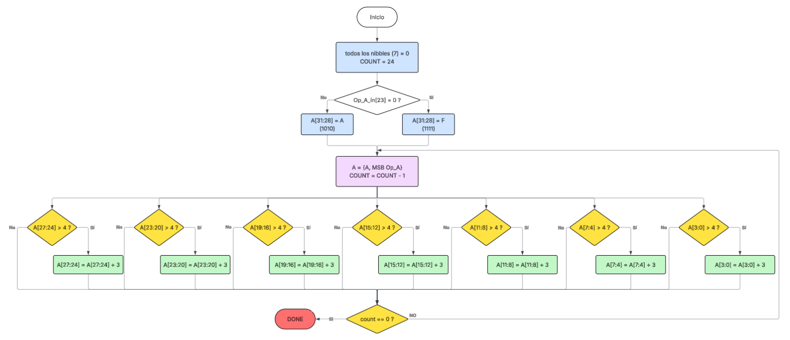
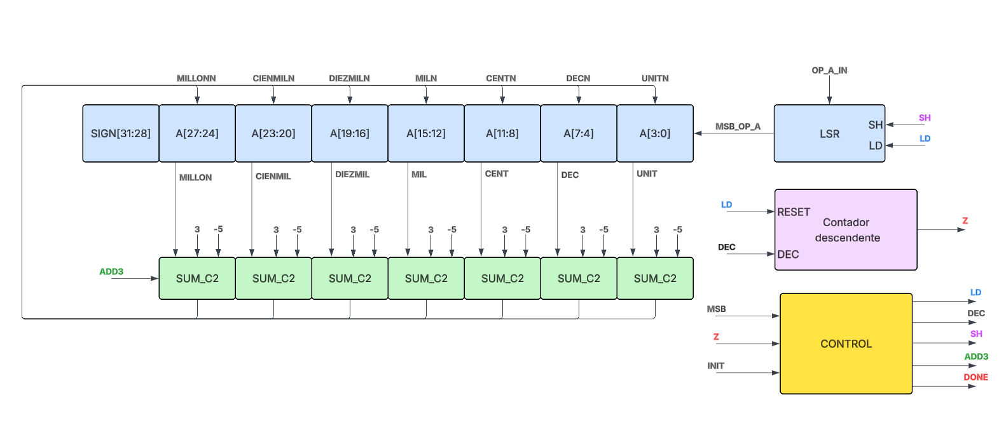
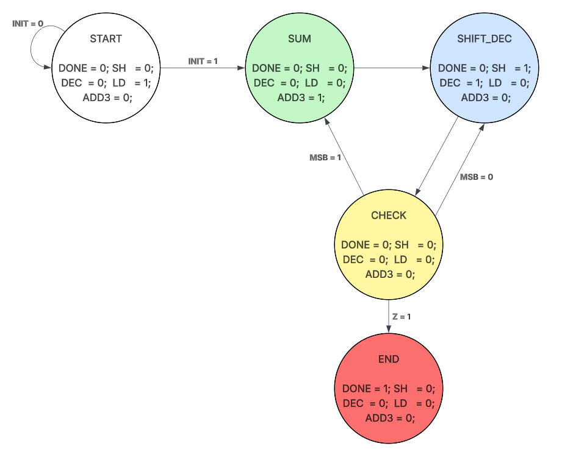
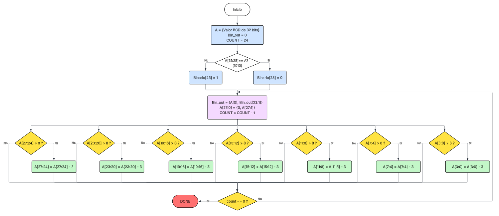
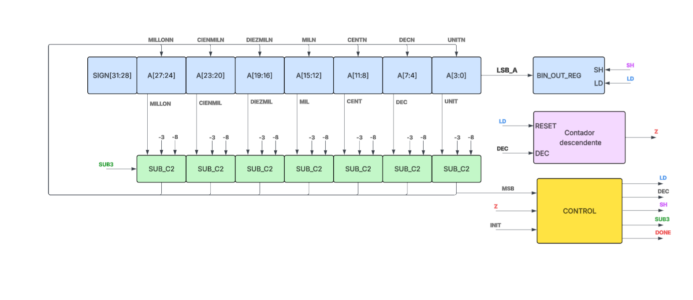
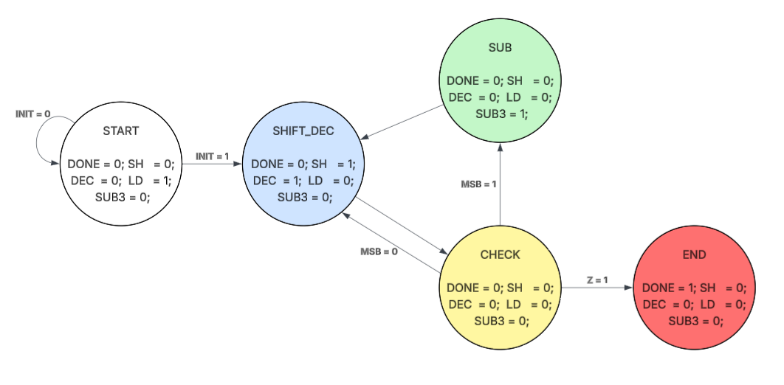

## 📘 Descripción general

En esta carpeta se encuentran todos los archivos necesarios para el correcto funcionamiento de una calculadora.
la estructura del proyecto se muestra acontinuación: 

```Bash

\Calculadora
  \Diagramas
    Modulo_datapath.png
    Modulo_estados.png
    Modulo_flujo.png

  \firmware
    \asm
      Modulo.S
      Modulo.o
      Makefile

  \rtl
    \cores
      ...
      \BCD_Binario     
      \Binario-BCD     
      \Divisor 
      \Multiplicador
      \Raiz
  Makefile
  bench_quark.v
  SOC_i9.lpf
  SOC.v
  
  \Simulaciones
    Simulacion_Periferico.vcd
    ...
    Visualizar_Simulacion.gtkw
  ...

```
Para cada periferico se crean los siguientes archivos:

- Los módulos necesarios para su funcionamiento
- Un módulo TOP
- Archivo en assembler adicional utilizado por la calculadora completa
- Periferico para su implementacion 

Además, se encuentran archivos adicionales necesarios para el funcionamiento de la calculadora junto con una carpeta para visualizar la simulacion de cada periferico.

---

### ✖️ Multiplicador 

El módulo implementa un multiplicador secuencial basado en corrimientos y sumas parciales. Adicionalmente se diseño con la finalidad de usar numeros tanto positivos como negativos.

Este módulo toma dos operandos de 16 bits y produce un resultado de 32 bits utilizando un proceso iterativo controlado por una máquina de estados.

Se describe con mas detalle el funcionamiento del modulo mediante el uso de 3 diagramas, Diagrama de flujo, Datapath y Diagrama de estados; a continuación se anexan estos 3 diagramas.

<p align="center">
  
   
  
</p>


A modo de resumen, se específica en la siguiente tabla las diferentes variables presentes en el diseño.

| Señal    | I/O    | Bits | Descripción                     |
| -------- | ------ | ---- | ------------------------------- |
| `A`      | Input  |  16  | Multiplicando                   |
| `B`      | Input  |  16  | Multiplicador                   |
| `init`   | Input  |   1  | Inicia la operación             |
| `clk`    | Input  |   1  | Señal de reloj                  |
| `DONE`   | Output |   1  | Indica que la operación terminó |
| `R`      | Output |  32  | Resultado final                 |


Hay 8 archivos relacionados a este Periferico:

- `Multiplicador.S` — Archivo en Assembler con el objetivo de realizar la comunicación entre el periférico y el procesador, se encientra en la carpeta de asm.

- `Periferico_Multiplicador.v` — Archivo que instancia el módulo multiplicador como un periférico de un procesador RISC-V.

- `TOP_Multiplicador.v` — Módulo TOP del multiplicador, el cual declara las variables de entrada y salida del módulo, además de llamar el resto de módulos necesarios.

- `Control_Multiplicador.v` — Modulo que ejecuta el diagrama de estados para el correcto funcionamiento del algoritmo.

- `Contador_Multiplicador.v` — Contador descendente que analiza los ciclos faltantes.

- `B_long_Multiplicador.v` — Modulo que registra los corrimientos del multiplicador y va guardando el resultado de forma simultanea.

- `A_long_Multiplicador.v` — modulo que almacena el multiplicando.

- `Acumulador_Multiplicador.v` — modulo donde se contruye el resultado. 


---

### ➗ Divisor 

El módulo implementa un divisor secuencial basado en corrimientos y sumas parciales. Adicionalmente se diseño con la finalidad de usar numeros tanto positivos como negativos.

Este módulo toma dos operandos de 16 bits y produce un resultado menor a 16 bits utilizando un proceso iterativo controlado por una máquina de estados.

Se describe con mas detalle el funcionamiento del modulo mediante el uso de 3 diagramas, Diagrama de flujo, Datapath y Diagrama de estados; a continuación se anexan estos 3 diagramas.

<p align="center">
  
   
  
</p>


A modo de resumen, se específica en la siguiente tabla las diferentes variables presentes en el diseño.

| Señal      | I/O    | Bits | Descripción                     |
| --------   | ------ | ---- | ------------------------------- |
|`Dividendo` | Input  |  32  | Dividendo                       |
|`DR`        | Input  |  32  | Divisor                         |
|`INIT`      | Input  |   1  | Inicia la operación             |
|`CLK`       | Input  |   1  | Señal de reloj                  |
|`DONE`      | Output |   1  | Indica que la operación terminó |
|`Resultado` | Output |  32  | Resultado final                 |
|`Residuo`   | Output |  32  | Residuo final                   |


Hay 9 archivos relacionados a este Periferico:

- `Divisor.S` — Archivo en Assembler con el objetivo de realizar la comunicación entre el periférico y el procesador.

- `Periferico_Divisor.v` — Archivo que instancia el módulo divisor como un periférico de un procesador RISC-V.

- `Top_Divisor.v` — Módulo TOP del divisor, el cual declara las variables de entrada y salida del módulo, además de llamar el resto de módulos necesarios.

- `Control_Divisor.v` — Máquina de control del periférico. Genera señales de control para el correcto funcionamiento del periférico (basado en el diagrama de estados).

- `Corregir_Divisor.v` — Modulo que se encarga de corregir el signo al resultado final.

- `Contador_Divisor.v` — Contador descendente para llevar un registro de ciclos de ejecución realizados.

- `RegistroA_Divisor.v` — Modulo encargado de llevar y realizar todos los cambios relacionados al registro A, ademas , se almacena el residuo.

- `.RegistroDV_Divisor.v` — Modulo encargado de recibir el dividendo y realizar todos los cambios relacionados a este, ademas de almacenar el resultado final.

- `Sumador_Divisor.v` — Modulo encargado de realizar una operacion de suma en complemento a dos con la finalidad de aprobar o descartar la operacion.


---

### ✔️ Raiz 

Este módulo implementa la Raíz cuadrada binaria mediante un procedimiento similar a una division larga, utiliza corrimientos, comparador con el uso de un sumador en complemento a dos y una máquina de control que coordina las etapas.

Se describe con mas detalle el funcionamiento del modulo mediante el uso de 3 diagramas, Diagrama de flujo, Datapath y Diagrama de estados; a continuación se anexan estos 3 diagramas.

<p align="center">
  
   
  
</p>

A modo de resumen, se específica en la siguiente tabla las diferentes variables presentes en el diseño.

| Señal      | I/O    | Bits | Descripción                     |
| --------   | ------ | ---- | ------------------------------- |
| `Op_A`     | Input  | 16   | Numero del cual obtener su raíz |
| `INIT`     | Input  | 1    | Inicia la operación             |
| `CLK`      | Input  | 1    | Señal de reloj                  |
| `DONE`     | Output | 1    | Indica que la operación terminó |
| `Resultado`| Output | 16   | Resultado final                 |


Hay 9 archivos relacionados a este Periferico:

- `Raiz.S` — Archivo en Assembler con el objetivo de realizar la comunicación entre el periférico y el procesador.

- `Periferico_raiz.v` — Archivo que instancia el módulo Raíz como un periférico de un procesador RISC-V.

- `RAIZ.v` — Módulo TOP de la Raíz cuadrada, el cual declara las variables de entrada y salida del módulo, además de llamar el resto de módulos necesarios.

- `CONTROL_RAIZ.v` —   Máquina de control del periférico. Genera señales de control para el correcto funcionamiento del periférico (basado en el diagrama de estados).

- `COUNT_RAIZ.v` — Contador descendente para llevar un registro de ciclos de ejecución realizados.

- `LSR_A_RAIZ.v` — Toma el valor original y realiza un desplazamiento de dos bits para realizar la comparación del número con el resultado parcial.

- `LSR_R_RAIZ.v` — Se va construyendo el resultado mediante un corrimiento bit a bit y una señal de control R0.
 
- `LSR_TMP_RAIZ.v` — Registro de almacenamiento temporal del resultado parcial para su posterior uso en el sumador en complemento a dos. 

- `SUM_C2_RAIZ.v` — Sumador en complemento a dos que realiza la comparación directa de la pareja de bits en LSR_A_RAIZ y LSR_TMP_RAIZ concatenado con un uno para validar la operación.
 
---

### 🔢 Binario_BCD 

Este módulo implementa la conversión de un número binario con signo a código BCD mediante el algoritmo Double Dabble (Shift-Add-3).

El diseño realiza desplazamientos sucesivos sobre el número binario de entrada mientras corrige cada nibble BCD mediante la operación +3 cuando un dígito es mayor o igual a 5. Todo el proceso es coordinado mediante una máquina de estados y registros de desplazamiento independientes para el número binario y el resultado BCD.

El módulo soporta números positivos y negativos en complemento a dos de 24 bits. Para representar el signo se utiliza un nibble adicional (SIGN) 

Se describe con mas detalle el funcionamiento del modulo mediante el uso de 3 diagramas, Diagrama de flujo, Datapath y Diagrama de estados; a continuación se anexan estos 3 diagramas.

<p align="center">
  
   
  
</p>

A modo de resumen, se específica en la siguiente tabla las diferentes variables presentes en el diseño.


| Señal      | I/O    | Bits | Descripción                     |
| --------   | ------ | ---- | ------------------------------- |
| `Op_A`     | Input  | 24   | Número binario con signo        |
| `INIT`     | Input  | 1    | Inicia la operación             |
| `CLK`      | Input  | 1    | Señal de reloj                  |
| `DONE`     | Output | 1    | Indica que la operación terminó |
| `MILLON`   | Output | 4    | Dígito de millones              |
| `CIENMIL`  | Output | 4    | Dígito de cientos de mil        |
| `DIEZMIL`  | Output | 4    | Dígito de decenas de mil        |
| `MIL`      | Output | 4    | Dígito de miles                 |
| `CENT`     | Output | 4    | Dígito de centenas              |
| `DEC`      | Output | 4    | Dígito de decenas               |
| `UNIT`     | Output | 4    | Dígito de unidades              |


Hay 7 archivos relacionados a este Periferico:

- `B_BCD.S` — Archivo en Assembler con el objetivo de realizar la comunicación entre el periférico y el procesador.

- `Periferico_Binario_BCD.v` — Archivo que instancia el módulo Top como un periférico de un procesador RISC-V.

- `Top_Binario_BCD.v` — Módulo TOP del conversor binario a BCD, el cual declara las variables de entrada y salida del módulo, además de llamar el resto de módulos necesarios.

- `Control_Binario_BCD.v` —   Máquina de control del periférico. Genera señales de control para el correcto funcionamiento del periférico (basado en el diagrama de estados).

- `Contador_Binario_BCD.v` — Contador descendente para llevar un registro de ciclos de ejecución realizados.

- `LSR_Binario_BCD.v` — Toma el valor original y realiza un desplazamiento de un bit a la izquiera para poder desarrollar el procedimiento correctamente.

- `Sumador_Binario_BCD.v` — sumador en complemento a dos para realizar la comparacion y verificacion ed cada nibble.
 

---

### 🔢 BCD_Binario 

Este módulo implementa la conversión de un número en codigo BCD con signo a binario mediante el inverso del algoritmo Double Dabble (Shift-Add-3 inverso).

El diseño realiza desplazamientos sucesivos sobre el número binario de entrada mientras corrige cada nibble BCD mediante la operación -3 cuando un dígito es mayor o igual a 8. Todo el proceso es coordinado mediante una máquina de estados y registros de desplazamiento independientes para el número BCD y el resultado en binario.

El módulo soporta números positivos y negativos en complemento a dos de 24 bits. Para representar el signo se utiliza un nibble adicional (SIGN) 

Se describe con mas detalle el funcionamiento del modulo mediante el uso de 3 diagramas, Diagrama de flujo, Datapath y Diagrama de estados; a continuación se anexan estos 3 diagramas.

<p align="center">
  
   
  
</p>

A modo de resumen, se específica en la siguiente tabla las diferentes variables presentes en el diseño.


| Señal      | I/O    | Bits | Descripción                     |
| --------   | ------ | ---- | ------------------------------- |
| `MILLON`   | Input  | 4    | Dígito de millones              |
| `CIENMIL`  | Input  | 4    | Dígito de cientos de mil        |
| `DIEZMIL`  | Input  | 4    | Dígito de decenas de mil        |
| `MIL`      | Input  | 4    | Dígito de miles                 |
| `CENT`     | Input  | 4    | Dígito de centenas              |
| `DEC`      | Input  | 4    | Dígito de decenas               |
| `UNIT`     | Input  | 4    | Dígito de unidades              |
| `INIT`     | Input  | 1    | Inicia la operación             |
| `CLK`      | Input  | 1    | Señal de reloj                  |
| `DONE`     | Output | 1    | Indica que la operación terminó |
| `Op_A_out` | Output | 24   | Número binario con signo        |


Hay 7 archivos relacionados a este Periferico:

- `BCD_Binario.S` — Archivo en Assembler con el objetivo de realizar la comunicación entre el periférico y el procesador.

- `Periferico_BCD_Binario.v` — Archivo que instancia el módulo Top como un periférico de un procesador RISC-V.

- `Top_BCD_Binario.v` — Módulo TOP del conversor binario a BCD, el cual declara las variables de entrada y salida del módulo, además de llamar el resto de módulos necesarios.

- `Control_BCD_Binario.v` —   Máquina de control del periférico. Genera señales de control para el correcto funcionamiento del periférico (basado en el diagrama de estados).

- `Contador_BCD_Binario.v` — Contador descendente para llevar un registro de ciclos de ejecución realizados.

- `RSR_BCD_Binario.v` — Toma el valor original y realiza un desplazamiento de un bit a la derecha para poder desarrollar el procedimiento correctamente.

- `Sumador_BCD_Binario.v` — sumador en complemento a dos para realizar la comparacion y verificacion ed cada nibble.