## 📘 Descripción general

En esta carpeta se encuentran todos los archivos necesarios para el funcionamiento del proyecto principal de la asignatura.

la estructura del proyecto se muestra acontinuación: 

```Bash
\proyecto principal

      \Diagramas
        I2C_Datapath.png
        I2C_Estados.png
        I2C_Flujo.png

        ADS1115_datapath.png
        ADS1115_estados.png
        ADS1115_flujo.png

        Timer_Ws2812_Datapath.png
        Timer_Ws2812_Estados.png
        Timer_Ws2812_Flujo.png

        Ws2812_LED_Datapath.png
        Ws2812_LED_Estados.png
        Ws2812_LED_Flujo.png

        Ws2812_LED_Array_Datapath.png
        Ws2812_LED_Array_Estados.png
        Ws2812_LED_Array_Flujo.png

      \Codigo_Pantalla
        Makefile
        Pantalla.v
        Pantalla_TB.v
        Pantalla_i9.lpf

        \Timer_ws2812
          Control_Timer_WS2812.v
          Timer_WS2812.v
          Timer_WS2812_TB.v
          comp_timer_ws2812.v
          count_out.v
          mux_timer_ws2812.v

        \WS2812_led
          Control_WS2812_LED.v
          Count_24.v
          LSR_RGB.v
          WS2812_led.v
          WS2812_led_TB.v

        \WS2812_Led_Array
          Comp_Addr.v
          Control_WS2812_Led_Array.v
          Count_Addr.v
          Image_0.v
          Image_1.v
          Image_2.v
          Image_3.v
          Image_4.v
          Led_Mem.v
          WS2812_Led_Array.v
          WS2812_Led_Array_TB.v

        \build   (generado por make)

      \controlador_ADS1115
        \ADS1115_CONTROLER
          ADS1115_CONTROL.v
          ADS1115_DATA.v
          ADS1115_TOP.v
          TICK_GENERATOR.v

        \I2C
          CONTADOR_BITS.v
          CONTADOR_BYTES.v
          CONTROL.v
          I2C_CLOCK_GENERATOR.v
          SHIFT_REG.v
          TESTBENCH.v
          Top_I2C.v

        \build   (generado por make)

        CONTROLADOR_I2C_i9.lpf
        CONTROLADOR_I2C.v
        Makefile
        tb_CONTROLADOR_I2C.v

      \build   (generado por make)

    Makefile
    Pantalla_I2C.v
    TOP_PROYECTO_i9.lpf
    TOP_PROYECTO.v

    README.md
  ...

```
La carpeta `build/` contiene las salidas generadas automáticamente por el flujo de síntesis (`.json`, `.config`, `.bit`, `.svf`, `.rpt`) y no debe editarse manualmente; se regenera con `make`.


## 🔗 Integración final — TOP_PROYECTO

Esta sección explica la integración completa del proyecto: el controlador ADS1115 leyendo los datos de un sensor de humedad conectado a la pantalla WS2812, de forma que el nivel de humedad medido determina qué cara se muestra (feliz, seria, triste, neutral o error).

El sistema queda dividido en cuatro piezas nuevas sobre las carpetas ya existentes de `controlador_ADS1115` y `Codigo_Pantalla`:

1. **`TOP_PROYECTO.v`** — módulo superior que une ambos subsistemas.

2. **`Pantalla_I2C.v`** — puente de decisión entre la lectura del ADC y la imagen a mostrar.

3. **`Makefile`** archivo que realiza la sintesis de todos los modulos para el correcto funcionamiento en la FPGA.

4. **`TOP_PROYECTO.lpf`** archivo que mapea los pines fisicos de la fpga para realizar las conecciones con la pantalla y el sensor.

---

### TOP_PROYECTO.v

Módulo superior de todo el proyecto. Instancia y conecta los tres bloques principales:

- `ADS1115_TOP` — controlador del ADC externo, entrega `adc_value` (16 bits), `adc_valid` (pulso de dato nuevo) y `error_alert` (error persistente de comunicación I2C).

- `TOP_I2C` — maestro I2C genérico que maneja físicamente el bus (`SDA`, `SCL`).

- `Pantalla_I2C` — traduce la lectura del ADC en una selección de imagen para la matriz de LEDs.

Expone hacia la FPGA únicamente las señales físicas necesarias: `clk`, `reset`, el bus I2C (`SDA`/`SCL`) y la salida hacia la matriz WS2812 (`DOUT`, `DONE_M`).

Parámetros configurables:

- `CLK_FREQ_HZ`, `DELAY_MS` — frecuencia del sistema y periodo entre lecturas del ADC (heredados del controlador ADS1115).
- `ADDR_WIDTH`, `N_LEDS` — geometría de la matriz de LEDs (heredados de la pantalla).
- `UMBRAL_1`, `UMBRAL_2`, `UMBRAL_3` — fronteras de clasificación de humedad, calibradas empíricamente con el sensor **resistivo**:
  - `UMBRAL_1 = 6000` — frontera neutral (encharcado) ↔ feliz.
  - `UMBRAL_2 = 15000` — frontera feliz ↔ seria.
  - `UMBRAL_3 = 24000` — frontera seria ↔ triste (muy seco).

  > Nota: `adc_value` **alto** corresponde a tierra **seca** y `adc_value` **bajo** a tierra **húmeda**, según la curva de respuesta medida de un sensor resistivo (≈26.400 en aire/seco, ≈4.000–6.000 en tierra húmeda). Si se cambia a un sensor capacitivo, estos umbrales deben recalcularse con su propia curva.

---

### Pantalla_I2C.v

Actúa como controlador intermedio entre el dato del ADS1115 y el core de la matriz de LEDs (`WS2812_Led_Array`). No conoce el protocolo I2C ni el protocolo WS2812; solo decide **qué imagen mostrar** y **cuándo pedir el reenvío** de la matriz completa.

Lógica de clasificación (`img_sel_actual`), evaluada en cada ciclo:

c

La prioridad de evaluación es fija: primero se revisa error, luego validez del dato, y solo después los umbrales de humedad — así un error de I2C siempre se refleja en pantalla sin importar el último valor válido leído.

Como el envío de una imagen completa a la matriz WS2812 toma varios ciclos de reloj (no es instantáneo), el módulo implementa una pequeña lógica de control con dos registros:

- `pending_img_sel` — última clasificación calculada, puede cambiar en cualquier ciclo.
- `active_img_sel` — imagen que realmente se está transmitiendo en este momento.

Cuando `pending_img_sel` cambia y el core no está ocupado (`core_busy = 0`), se dispara un pulso `init_m` de un ciclo que arranca el envío de la nueva imagen hacia `WS2812_Led_Array`. Si llegan varios cambios de clasificación mientras el core sigue ocupado transmitiendo la imagen anterior, solo se envía la última clasificación pendiente al terminar (no se encolan envíos intermedios).

---
### TOP_PROYECTO_i9.lpf

este archivo declara los pines fisicos que se conectaran directamente entre la FPGA y el sensor ADS1115 ademas de la pantalla y un reset. 

| PINES      |  Significado                                |
|------------|---------------------------------------------|
| `P3`       | Reloj de la FPGA a 25MHZ                    |
| `K18`      | Señal de reset                              |
| `D2`       | Linea SDA del protocolo I2C                 |
| `E2`       | Linea SCL del protocolo I2C                 |
| `T1`       | DOUT directo para la entrada de la pantalla |

---

##  PANTALLA LED

La carpeta `Codigo_Pantalla` contiene los archivos necesarios para controlar una matriz de 64 LEDs direccionables WS2812, organizada físicamente como una pantalla de 8×8. Cada LED recibe una palabra de 24 bits en formato **GRB**, es decir, 8 bits para verde, 8 bits para rojo y 8 bits para azul.

El controlador se encuentra dividido en tres niveles. El primer nivel genera los tiempos necesarios para transmitir un bit siguiendo el protocolo WS2812; el segundo nivel envía los 24 bits correspondientes al color de un LED; y el tercer nivel recorre las 64 posiciones de la matriz, consulta el color almacenado para cada dirección y transmite una imagen completa.

La carpeta se divide en los siguientes bloques:

1. **`Timer_ws2812`** — genera la forma de onda correspondiente a un bit `0`, un bit `1` o una señal de reset.

2. **`WS2812_led`** — transmite los 24 bits GRB correspondientes a un LED individual.

3. **`WS2812_Led_Array`** — recorre la matriz completa, selecciona una imagen y envía el color correspondiente a cada LED.

Además, `Pantalla.v` funciona como módulo superior para probar la pantalla de manera independiente, interpretando una cantidad de pulsos recibidos por la entrada `sensor` como el número de la imagen que debe mostrarse.

---

###  📥 Timer_WS2812

Este bloque genera la temporización necesaria para representar cada símbolo del protocolo WS2812. La entrada `SEL` determina el tipo de transmisión que debe realizarse:

- `SEL = 0` — transmisión de un bit lógico `0`.
- `SEL = 1` — transmisión de un bit lógico `1`.
- `SEL = 2` — intervalo de reset del protocolo WS2812.

Con el reloj de 25 MHz definido para la FPGA, cada ciclo tiene una duración de 40 ns. Los valores establecidos en `mux_timer_ws2812.v` corresponden a 10 ciclos para `T0H` (400 ns), 20 ciclos para `T1H` (800 ns), 31 ciclos para el periodo total de cada bit (1,24 µs) y 1250 ciclos para el reset (50 µs).

Los diagramas siguientes muestran el funcionamiento del temporizador, la interconexión de sus componentes y la máquina de estados que controla la salida `DOUT`.

<p align="center">
  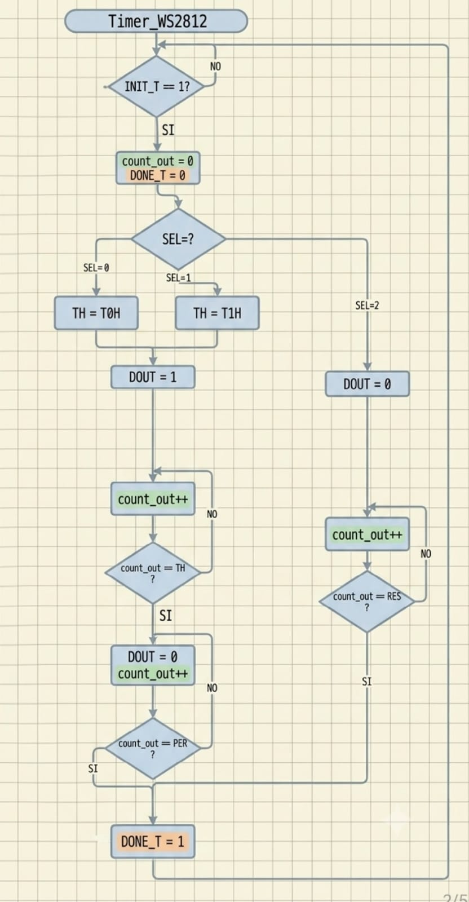
  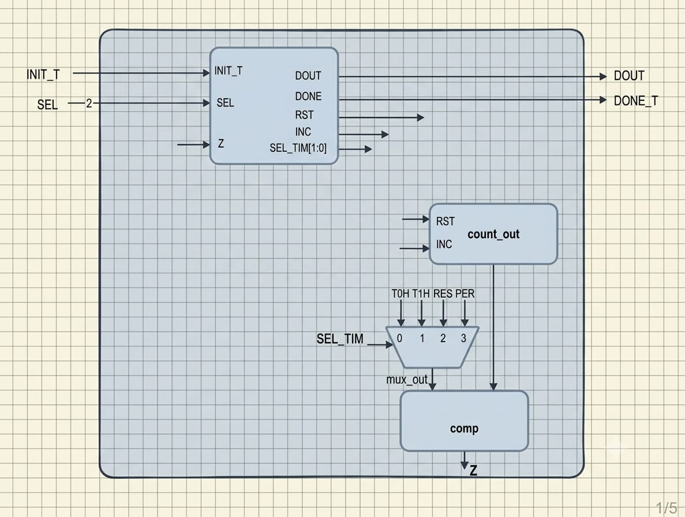
  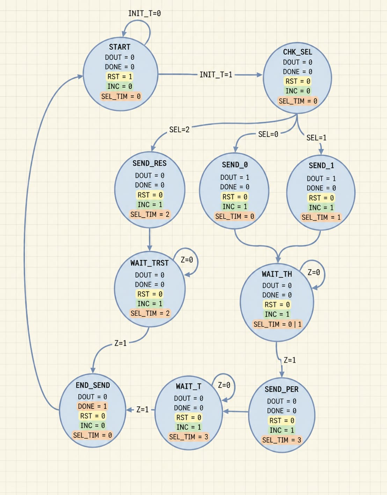
</p>

La carpeta posee seis archivos necesarios para el funcionamiento y la simulación del temporizador:

- `Control_Timer_WS2812.v` — Implementa la máquina de estados del temporizador. Según el valor de `SEL`, selecciona el estado encargado de transmitir un `0`, un `1` o el reset. Durante `SEND_0` y `SEND_1` mantiene `DOUT` en alto durante el tiempo correspondiente y después pasa a `WAIT_T`, donde completa en bajo el periodo del bit. Para el reset mantiene directamente la salida en bajo durante el tiempo configurado. La señal `DONE_T` indica que la temporización solicitada terminó.

- `count_out.v` — Contador ascendente de 11 bits. Se reinicia mediante `RST` y aumenta en cada ciclo mientras `INC` se encuentra activa. Su valor representa la cantidad de ciclos transcurridos durante la transmisión actual.

- `mux_timer_ws2812.v` — Multiplexor que contiene los cuatro valores de tiempo utilizados por el protocolo: `T0H`, `T1H`, `RES` y `PER`. La señal `SEL_TIM`, generada por la unidad de control, selecciona cuál de estos valores será comparado con el contador.

- `comp_timer_ws2812.v` — Compara el valor del contador con el tiempo seleccionado. La bandera `Z` se activa cuando se alcanza el último ciclo del intervalo y permite que la máquina de estados continúe con la siguiente etapa.

- `Timer_WS2812.v` — Módulo top del temporizador. Instancia y conecta la unidad de control, el contador, el multiplexor de tiempos y el comparador. Recibe `INIT_T` y `SEL`, y entrega la señal serial `DOUT` junto con la bandera `DONE_T`.

- `Timer_WS2812_TB.v` — Comprueba de manera independiente la duración de la señal para un bit `0`, un bit `1` y el reset. El testbench cuenta los ciclos totales y los ciclos durante los cuales `DOUT` permanece en alto para verificar la temporización generada.

---

###  📥 WS2812_LED

Este bloque se encarga de transmitir la información de color correspondiente a un solo LED. El dato de entrada `RGB[23:0]` se encuentra organizado en formato **GRB** y se transmite comenzando por el bit más significativo.

Al recibir un pulso en `INIT`, el registro carga los 24 bits del color y el contador se inicializa en 24. La unidad de control revisa `RGB_MSB`, solicita al temporizador el envío de un bit `0` o `1`, espera la señal `DONE_T`, desplaza el registro una posición a la izquierda y disminuye el contador. El proceso se repite hasta transmitir los 24 bits, momento en el que se activa `DONE`.

La entrada `RST_CMD` permite solicitar el intervalo de reset del protocolo en lugar de transmitir un color.

<p align="center">
  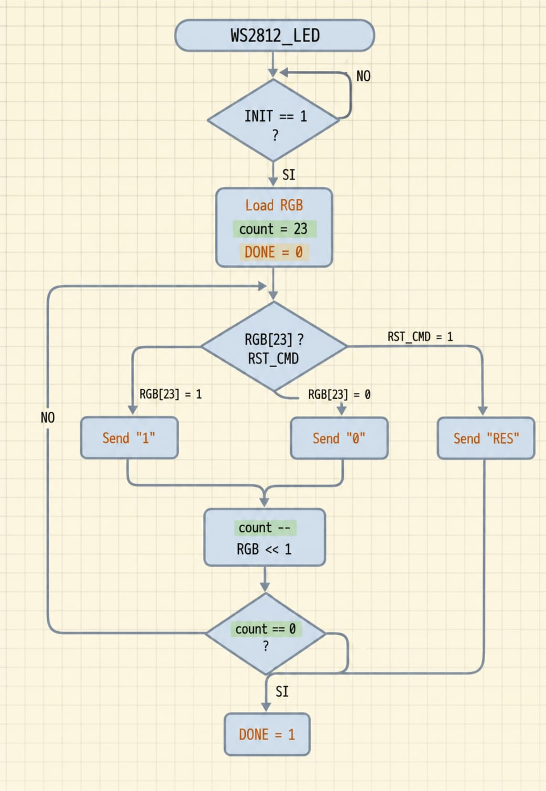
  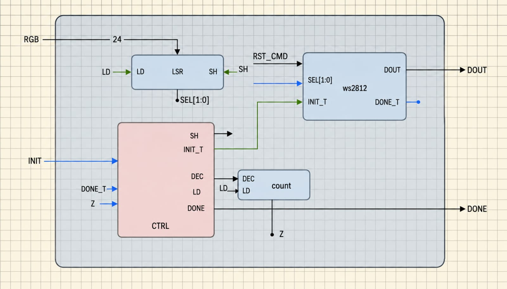
  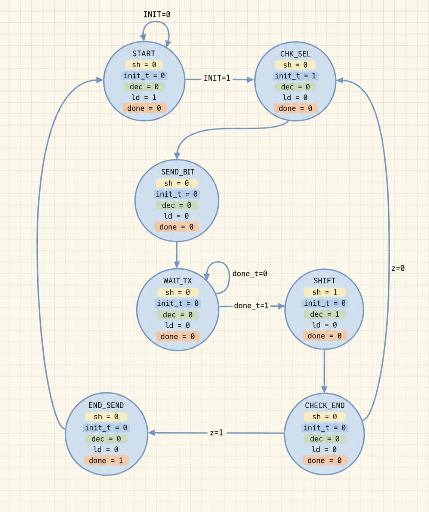
</p>

La carpeta posee cinco archivos:

- `Control_WS2812_LED.v` — Máquina de estados encargada de coordinar el envío de los 24 bits. Selecciona el tipo de temporización a partir de `RGB_MSB`, genera el pulso `INIT_T`, espera la finalización del temporizador y activa las señales `SH` y `DEC` para continuar con el siguiente bit. Después de transmitir todos los bits genera la señal `DONE`.

- `LSR_RGB.v` — Registro de desplazamiento de 24 bits. Cuando `LD` está activa carga el valor `RGB`; cuando `SH` está activa desplaza el contenido una posición a la izquierda. La salida `RGB_MSB` expone el bit que debe enviarse en cada iteración.

- `Count_24.v` — Contador descendente que se carga con el valor 24 y disminuye después de cada bit transmitido. La bandera `Z` se activa cuando el contador llega a cero e indica a la unidad de control que el LED fue enviado completamente.

- `WS2812_led.v` — Módulo top de este nivel. Instancia `LSR_RGB`, `Count_24`, `Control_WS2812_LED` y `Timer_WS2812`, conectando el camino de datos con las señales producidas por la unidad de control.

- `WS2812_led_TB.v` — Verifica el envío de colores verde, rojo y azul puros usando el orden GRB. Después de cada color también solicita un reset y comprueba que la señal `DONE` sea generada antes de alcanzar el tiempo máximo definido en la prueba.

---

###  📥 WS2812_LED_ARRAY

Este bloque controla la transmisión de una imagen completa. Cada LED de la matriz posee una dirección entre 0 y 63. Para cada dirección, `Led_Mem` entrega una palabra GRB de 24 bits y el módulo `WS2812_led` realiza su transmisión serial.

Cuando se activa `INIT_M`, el contador de direcciones se reinicia y comienza el envío desde `ADDR = 0`. La unidad de control espera que termine cada LED, incrementa la dirección y repite el proceso hasta alcanzar `N_LEDS`. Al completar toda la matriz se activa `DONE_M`.

La selección de la imagen se realiza mediante `IMG_SEL`. El diseño actual contiene cinco imágenes:

- `IMG_SEL = 0` — todos los LEDs encendidos en azul celeste o cian; se utiliza como imagen inicial.
- `IMG_SEL = 1` — cara feliz en verde claro.
- `IMG_SEL = 2` — cara seria en anaranjado.
- `IMG_SEL = 3` — cara triste en rojo.
- `IMG_SEL = 4` — señal de error representada mediante una X roja.

Cualquier valor diferente apaga todos los LEDs.

<p align="center">
  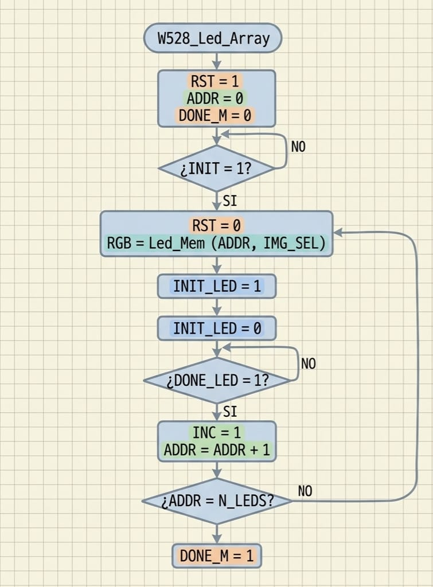
  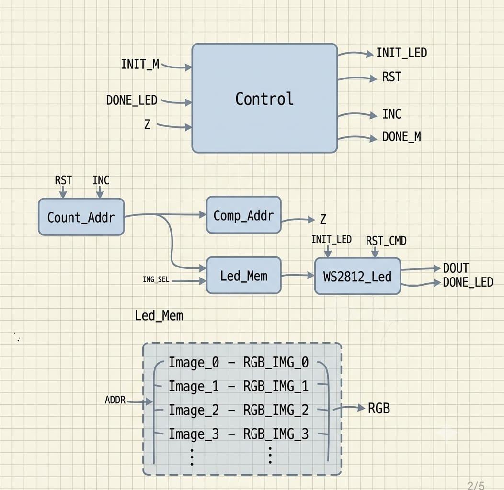
  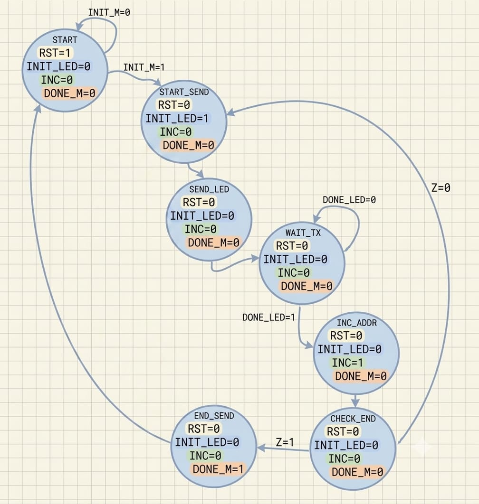
</p>

La carpeta posee los siguientes archivos:

- `Control_WS2812_Led_Array.v` — Máquina de estados que coordina el recorrido de la matriz. Genera `INIT_LED` para comenzar la transmisión de cada posición, espera `DONE_LED`, incrementa la dirección y verifica la bandera `Z`. Cuando se han enviado todos los LEDs activa `DONE_M`.

- `Count_Addr.v` — Contador ascendente que almacena la dirección del LED actual. Se reinicia con `RST` y se incrementa mediante `INC` después de completar cada transmisión.

- `Comp_Addr.v` — Compara la dirección actual con el parámetro `N_LEDS`. La bandera `Z` se activa cuando se alcanzó la cantidad total de LEDs configurada.

- `Led_Mem.v` — Memoria combinacional encargada de seleccionar el color de la dirección actual. Instancia las cinco imágenes y utiliza `IMG_SEL` para conectar una de ellas a la salida `RGB`.

- `Image_0.v` — Define el color de las 64 posiciones de la imagen inicial azul celeste o cian.

- `Image_1.v` — Contiene las posiciones encendidas que forman la cara feliz en verde claro.

- `Image_2.v` — Contiene las posiciones encendidas que forman la cara seria en anaranjado.

- `Image_3.v` — Contiene las posiciones encendidas que forman la cara triste en rojo.

- `Image_4.v` — Contiene las posiciones diagonales que forman una X roja utilizada para indicar un error.

- `WS2812_Led_Array.v` — Módulo top del controlador de matriz. Instancia la unidad de control, el contador y comparador de direcciones, la memoria de imágenes y el controlador de un LED. Sus parámetros `ADDR_WIDTH` y `N_LEDS` permiten modificar el ancho de la dirección y la cantidad de LEDs que deben transmitirse.

- `WS2812_Led_Array_TB.v` — Simula el envío de las imágenes 0, 1, 2 y 3 sobre una matriz de 64 LEDs. Durante la simulación muestra la dirección, el color seleccionado, el inicio de cada LED y el momento en que se incrementa el contador.

---

Además de las tres carpetas anteriores, existen cuatro archivos principales para utilizar y probar la pantalla de manera independiente:

- `Pantalla.v` — Módulo superior de la pantalla. Sincroniza la entrada externa `sensor` mediante dos flip-flops para reducir problemas de metaestabilidad y detecta sus flancos de subida. Cada ráfaga de pulsos representa el número de una imagen; cuando transcurre el tiempo definido por `TIMEOUT_CYCLES` sin recibir otro pulso, el valor contado se almacena como nueva selección. El módulo mantiene por separado `pending_img_sel` y `active_img_sel`, evitando cambiar la imagen mientras el core continúa ocupado transmitiendo la anterior. Después de un reset envía automáticamente la imagen 0.

- `Pantalla_TB.v` — Verifica el funcionamiento completo del módulo `Pantalla`. Para reducir el tiempo de simulación utiliza ocho LEDs y un timeout pequeño. Primero comprueba el envío automático de la imagen 0 y posteriormente aplica ráfagas de uno, dos, tres y cuatro pulsos para seleccionar las imágenes restantes.

- `Pantalla_i9.lpf` — Define la asignación de pines para probar la pantalla de manera independiente sobre la Colorlight i9:

| PINES      | Significado                                      |
|------------|--------------------------------------------------|
| `P3`       | Reloj de la FPGA a 25 MHz                        |
| `K18`      | Señal de reset                                   |
| `L18`      | Entrada de pulsos utilizada como señal `sensor`  |
| `C18`      | Salida serial `DOUT` hacia la matriz WS2812      |
| `G18`      | Señal `DONE_M` de finalización de una imagen     |

- `Makefile` — Automatiza la simulación con Icarus Verilog y GTKWave, la síntesis con Yosys, el place and route con nextpnr-ecp5, la generación del archivo `.bit` mediante `ecppack` y la configuración de la FPGA mediante `openFPGALoader`. Los archivos generados se almacenan dentro de la carpeta `build/`.

---

##  Controlador  ADS1115 

Esta carpeta contiene una de las partes principales del proyecto principal: un controlador digital para el ADC externo ADS1115.

El objetivo del diseño es leer periódicamente, por el bus I2C, el valor digital de la conversión que realiza el ADS1115 y dejarlo disponible dentro de la FPGA como una palabra de 16 bits (adc_value). Para esto el proyecto se divide en dos bloques independientes que se comunican entre sí:

1. Un controlador (ADS1115_CONTROLER) que conoce el protocolo específico del ADS1115 (registros, secuencia de configuración y tiempos de espera entre lecturas).

2. Un maestro I2C genérico (I2C) que no conoce nada del ADS1115: solo sabe transmitir/recibir bytes por el bus I2C cuando se le indica una dirección, un modo (lectura/escritura) y una cantidad de bytes.


###  📥 ADS1115_CONTROLER 
 
Esta carpeta posee cuatro archivos fundamentales para la comunicacion con el ADS1115; el objetivo principal es implementar una máquina de estados que realice **el protocolo de configuración y lectura periódica del ADS1115**, usando al maestro I2C. No conoce los tiempos del bus I2C bit a bit; solo le pide al maestro escribir o leer N bytes y espera la señal `done`.
 
Secuencia que realiza en cada ciclo de lectura:
 
1. **Configuracion del ADC** escribiendo 4 bytes en el registro `CONFIG` (0x01): dirección + puntero de registro + 2 bytes de configuración. Los dos bytes de configuracion pueden ser modificados dependiendo del uso. (ver comentario en cabecera del archivo con el mapa de bits completo del registro `CONFIG`).

2. **Apuntar al registro de conversión** (0x00) escribiendo el puntero correspondiente.

3. **Leer 2 bytes** (MSB y LSB) del resultado de la conversión y arma `adc_value.

4. **Esperar** un tiempo configurable (`DELAY_MS`, por defecto 500 ms) usando `TICK_GENERATOR`, y vuelve al paso 2 para leer el siguiente dato (no repite la configuración salvo que exista un error o un reset).
 
Estos diagramas, permiten visualizar al detalle el funcionamiento de los modulos.


<p align="center">
  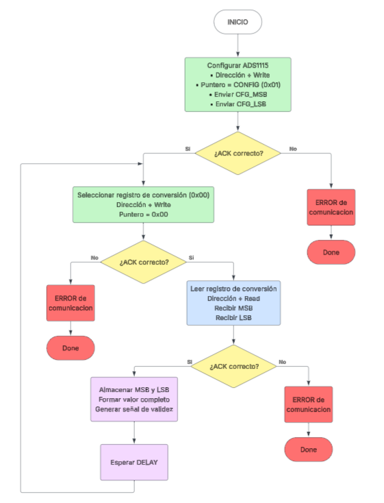
  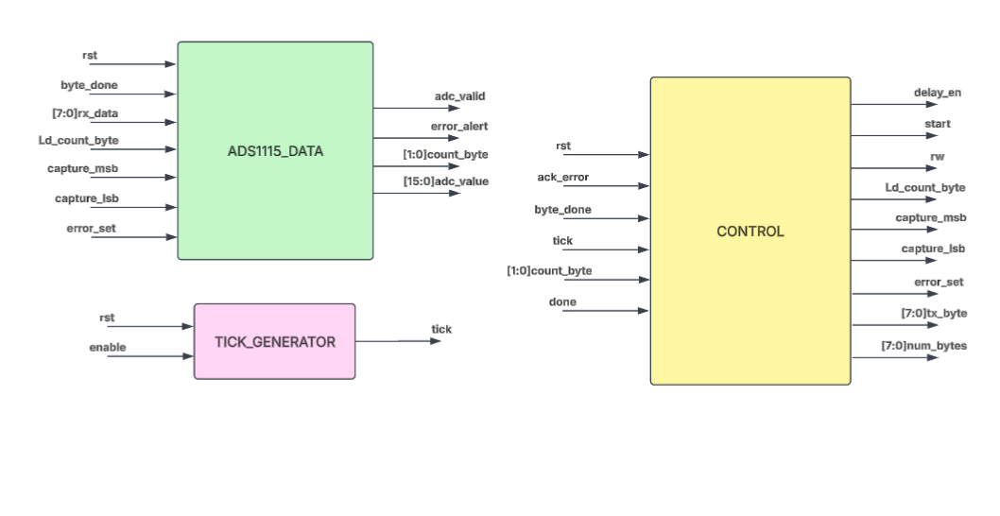
  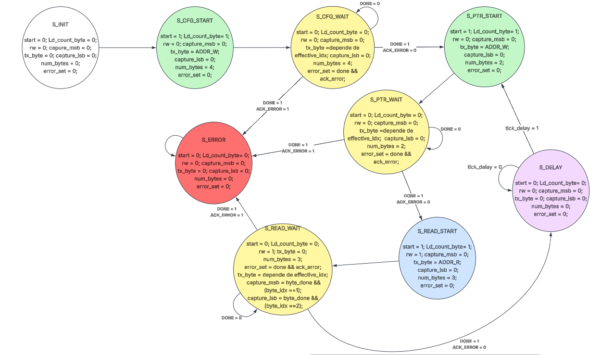
</p>

El controlador se divide en tres bloques principales y un modulo top:

- `ADS1115_CONTROL.v` — Implementa una máquina de estados encargada de coordinar toda la comunicación con el ADS1115 a través del maestro I2C. Durante el primer ciclo configura el registro `CONFIG` del ADC, posteriormente selecciona el registro de conversión `0x00`, solicita la lectura de dos bytes y espera un tiempo configurable antes de repetir el proceso. Además, supervisa la señal `ack_error` para detectar errores de comunicación.

- `ADS1115_DATA.v` — Se encarga de almacenar los dos bytes recibidos desde el maestro I2C, reconstruir el valor digital de 16 bits `adc_value`, generar un pulso `adc_valid` cuando una nueva conversión está disponible y mantener el índice del byte actualmente transmitido o recibido durante cada transacción.

- `TICK_GENERATOR.v` — Temporizador parametrizable en milisegundos. Cuenta ciclos de reloj hasta alcanzar `(CLK_FREQ_HZ / 1000) * DELAY_MS` y genera un pulso `tick` de un ciclo de duración. Solo cuenta mientras `enable` está activo; si `enable` baja, el contador se reinicia

- `ADS1115_TOP.v` — Módulo superior del controlador. Instancia los módulos ADS1115_CONTROL, ADS1115_DATA y TICK_GENERATOR, conectando las señales de control, datos y temporización. Su función es integrar todos los bloques necesarios para que el controlador interactúe con el maestro I2C y entregue el valor digital leído `adc_value` junto con las señales de estado `adc_valid y error_alert`.
 
---

###  📥 I2C 

en esta carpeta se encuentran los archivos nesesarios para la implementacion de un **maestro I2C** capaz de transmitir o recibir una ráfaga de N bytes hacia/desde un esclavo, gestionando internamente las condiciones de START, STOP, ACK/NACK y el reloj del bus (SCL). Es completamente independiente del ADS1115.

 Para profundizar mejor en el diseño del maestro I2C se encuentran estos 3 diagramas (Diagrama de flujo, Datapath y Diagrama de estados) que permiten una visualizacion del diseño y la separacion de tareas dentro de este.

<p align="center">
  
   
  
</p>

esta carpeta posee 6 archivos nesesarios para el correcto funcionamiento del protocolo ademas de un archivo adicional encargado de simular su funcionamiento.
 
 
- `Top_I2C.v` — Módulo TOP del maestro. Además de instanciar los submódulos siguientes, implementa la siguiente lógica **open-drain** del bus:
 
 `SDA` se libera a alta impedancia (`1'bz`) o se fuerza a `0`, nunca se maneja en alto directamente. Ademas, Sincroniza la entrada `SDA` con el reloj de la FPGA mediante dos flip-flops en cascada (`sda_meta` → `sda_sync`) para evitar metaestabilidad.

`SCL` se libera en alta impedancia cuando el generador de reloj interno la marca en alto, permitiendo *clock stretching* por parte del esclavo.

- `CONTROL.v` — Es una máquina de estados que recorre bit a bit y byte a byte toda la transacción I2C, sincronizada con los flancos de subida/bajada de SCL (`scl_rise` / `scl_fall`) que le entrega `I2C_CLOCK_GENERATOR`.
 
 
- `I2C_CLOCK_GENERATOR.v` — Genera la señal `SCL` dividiendo el reloj del sistema, calculando automáticamente el semiperiodo. Además entrega pulsos `scl_rise` y `scl_fall` de un ciclo de duración, usados por la amquina de control para sincronizar toda la máquina de estados. Si `enable` está en bajo, `scl` queda fija y el contador se mantiene en reposo.
 
- `SHIFT_REG.v` Registro de desplazamiento de 8 bits de doble función:  En transmisión (`shift_tx`): desplaza a la izquierda insertando un `0` por el bit menos significativo, y expone siempre el bit más significativo (`tx_bit = shift_reg[7]`) hacia el bus. En recepción (`shift_rx`): desplaza a la izquierda insertando el valor leído de `sda_in`. 

- `CONTADOR_BITS.v`— Contador descendente que cuenta los 8 bits de un byte. La bandera `z_bits` se activa cuando el contador llega a `0`, indicando a la maquina de control que ya se procesaron los 8 bits del byte actual.
 
- `CONTADOR_BYTES.v` — Contador descendente que cuenta los bytes restantes de la transacción completa. La bandera `z_bytes` indica que ya no quedan más bytes por transmitir/recibir, señal que usa la maquina de control para decidir si continuar la ráfaga o pasar a la condición de STOP.
 
- `TESTBENCH.v` — Simula un esclavo I2C que responde con ACK a las tramas de dirección y datos, permitiendo comprobar de forma independiente que `TOP_I2C.v` genera correctamente las condiciones de START/STOP, los 8 bits de cada byte y el manejo de ACK/NACK, antes de integrarlo con la lógica específica del ADS1115.
 
---

Esta separación permite que el maestro I2C sea reutilizable para comunicarse con cualquier periférico I2C, no solo con el ADS1115. Ademas, realizar esta separacion de tareas simplifica el desarrolo del maestro I2C, en especial su FSM.


Ademas de estas carpetas, se encuentran 4 archivos adicionales que complementan el desarrolo del controlador. Estos son:


- `CONTROLADOR_I2C.v` — Módulo top que instancia y conecta el `ADS1115_CONTROLLER` con `TOP_I2C`, y expone hacia la FPGA solo las señales físicas necesarias (reloj, reset y el bus I2C).
 
 - `Makefile` — automatiza tanto la simulación como el flujo de síntesis para la FPGA Colorlight i9:
 
- `CONTROLADOR_I2C_i9.lpf` — define la asignación de pines físicos en la tarjeta Colorlight i9:
 
- `tb_CONTROLADOR_I2C.v` — valida el sistema completo (`CONTROLADOR_I2C`), simulando un **ADS1115 esclavo completo**: responde ACK a la configuración, ACK al puntero de registro, y entrega valores de conversión simulados que van cambiando (0x1A55 → 0x2B66 → 0x3C77) en cada ciclo de lectura. El testbench declara éxito cuando adc_value refleja correctamente las tres lecturas esperadas, y cuenta con un timeout de seguridad de 20 ms simulados por si la máquina de estados quedara bloqueada.

---
 

 