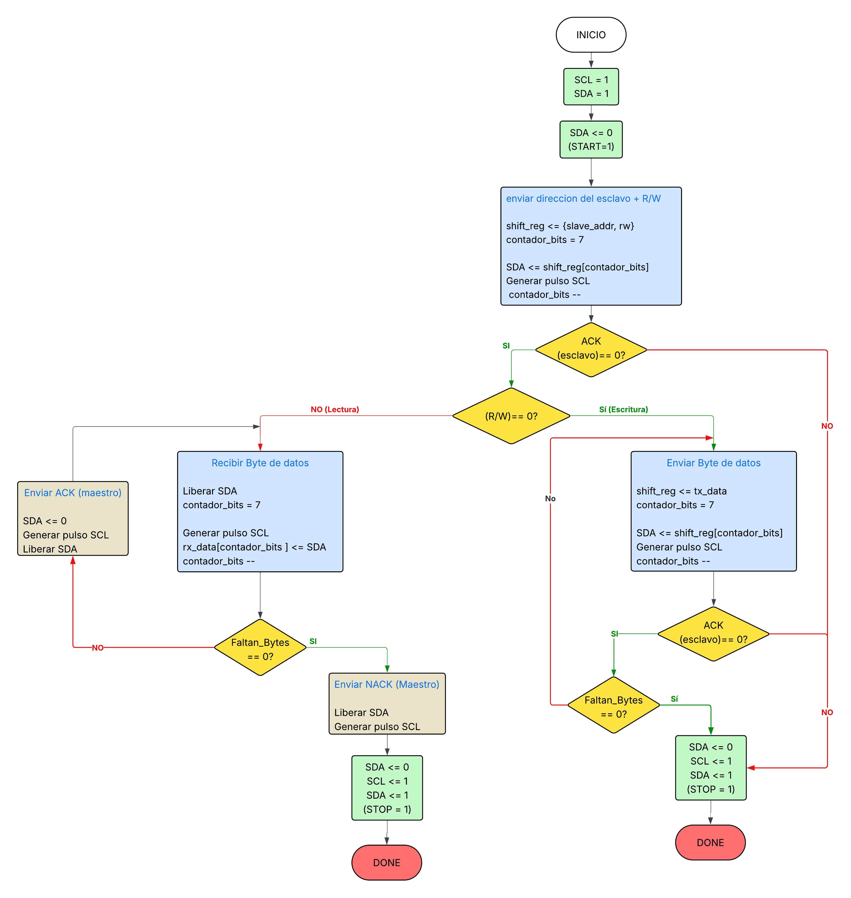
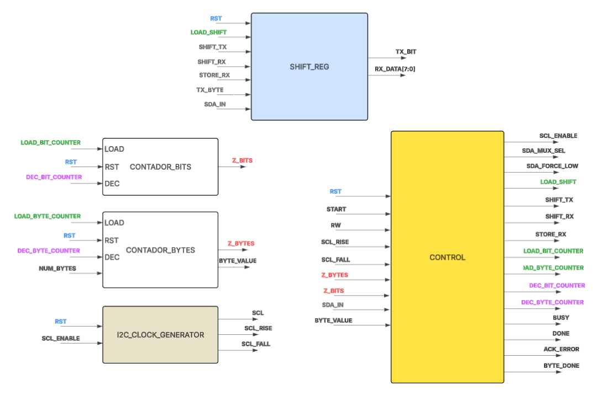
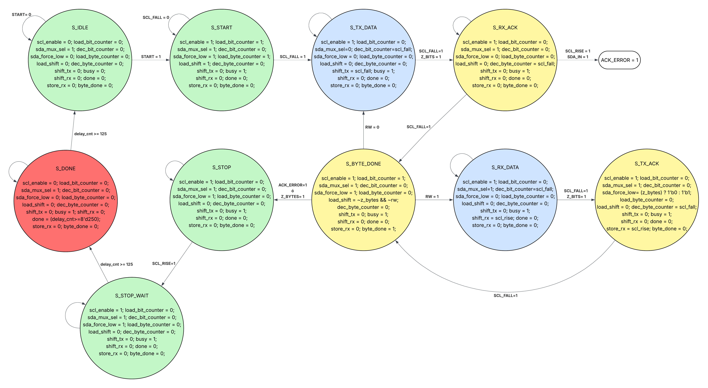

## 📘 Descripción general

En esta carpeta se encuentran todos los archivos necesarios para el funcionamiento del proyecto principal de la asignatura.

la estructura del proyecto se muestra acontinuación: 

```Bash

\proyecto principal

    \Diagramas
    
    \Codigo_pantalla

    \controlador ads1115
        \ADS1115_CONTROLLER
            ADS1115_CONTROL.v
            ADS1115_DATA.v
            ADS1115_TOP.v
            TICK_GENERATOR.v

        \I2C
            \CONTADOR_BITS.v     
            \CONTADOR_BYTES.v    
            \CONTROL.v 
            \I2C_CLOCK_GENERATOR.v
            \SHIFT_REG.v
            \Top_I2C.v

  ...

```
La carpeta `build/` contiene las salidas generadas automáticamente por el flujo de síntesis (`.json`, `.config`, `.bit`, `.svf`, `.rpt`) y no debe editarse manualmente; se regenera con `make`.

---

##  PANTALLA LED

<p align="center">
  
  
  
</p>

---

##  Controlador  ADS1115 

Esta carpeta contiene una de las partes principales del proyecto principal: un controlador digital para el ADC externo ADS1115.

El objetivo del diseño es leer periódicamente, por el bus I2C, el valor digital de la conversión que realiza el ADS1115 y dejarlo disponible dentro de la FPGA como una palabra de 16 bits (adc_value). Para esto el proyecto se divide en dos bloques independientes que se comunican entre sí:

1. Un controlador (ADS1115_CONTROLER) que conoce el protocolo específico del ADS1115 (registros, secuencia de configuración y tiempos de espera entre lecturas).

2. Un maestro I2C genérico (I2C) que no conoce nada del ADS1115: solo sabe transmitir/recibir bytes por el bus I2C cuando se le indica una dirección, un modo (lectura/escritura) y una cantidad de bytes.


###  📥 ADS1115_CONTROLER 
 

 
---

###  📥 I2C 

en esta carpeta se encuentran los archivos nesesarios para la implementacion de un **maestro I2C** capaz de transmitir o recibir una ráfaga de N bytes hacia/desde un esclavo, gestionando internamente las condiciones de START, STOP, ACK/NACK y el reloj del bus (SCL). Es completamente independiente del ADS1115.

 Para profundizar mejor en el diseño del maestro I2C se encuentran estos 3 diagramas (Diagrama de flujo, Datapath y Diagrama de estados) que permiten una visualizacion del diseño y la separacion de tareas dentro de este.

<p align="center">
  
   
  
</p>

esta carpeta posee 6 archivos nesesarios para el correcto funcionamiento del protocolo ademas de un archivo adicional encargado de simular su funcionamiento.
 
 
- `Top_I2C.v` — Módulo TOP del maestro. Además de instanciar los submódulos siguientes, implementa la siguiente lógica **open-drain** del bus:
 
 `SDA` se libera a alta impedancia (`1'bz`) o se fuerza a `0`, nunca se maneja en alto directamente. Ademas, Sincroniza la entrada `SDA` con el reloj de la FPGA mediante dos flip-flops en cascada (`sda_meta` → `sda_sync`) para evitar metaestabilidad.

`SCL` se libera en alta impedancia cuando el generador de reloj interno la marca en alto, permitiendo *clock stretching* por parte del esclavo.

- `CONTROL.v` — Es una máquina de estados que recorre bit a bit y byte a byte toda la transacción I2C, sincronizada con los flancos de subida/bajada de SCL (`scl_rise` / `scl_fall`) que le entrega `I2C_CLOCK_GENERATOR`.
 
 
- `I2C_CLOCK_GENERATOR.v` — Genera la señal `SCL` dividiendo el reloj del sistema, calculando automáticamente el semiperiodo. Además entrega pulsos `scl_rise` y `scl_fall` de un ciclo de duración, usados por la amquina de control para sincronizar toda la máquina de estados. Si `enable` está en bajo, `scl` queda fija y el contador se mantiene en reposo.
 
- `SHIFT_REG.v` Registro de desplazamiento de 8 bits de doble función:  En transmisión (`shift_tx`): desplaza a la izquierda insertando un `0` por el bit menos significativo, y expone siempre el bit más significativo (`tx_bit = shift_reg[7]`) hacia el bus. En recepción (`shift_rx`): desplaza a la izquierda insertando el valor leído de `sda_in`. 

- `CONTADOR_BITS.v`— Contador descendente que cuenta los 8 bits de un byte. La bandera `z_bits` se activa cuando el contador llega a `0`, indicando a la maquina de control que ya se procesaron los 8 bits del byte actual.
 
- `CONTADOR_BYTES.v` — Contador descendente que cuenta los bytes restantes de la transacción completa. La bandera `z_bytes` indica que ya no quedan más bytes por transmitir/recibir, señal que usa la maquina de control para decidir si continuar la ráfaga o pasar a la condición de STOP.
 
- `TESTBENCH.v` — Simula un esclavo I2C que responde con ACK a las tramas de dirección y datos, permitiendo comprobar de forma independiente que `TOP_I2C.v` genera correctamente las condiciones de START/STOP, los 8 bits de cada byte y el manejo de ACK/NACK, antes de integrarlo con la lógica específica del ADS1115.
 
---

Esta separación permite que el maestro I2C sea reutilizable para comunicarse con cualquier periférico I2C, no solo con el ADS1115. Ademas, realizar esta separacion de tareas simplifica el desarrolo del maestro I2C, en especial su FSM.


Ademas de estas carpetas, se encuentran 4 archivos adicionales que complementan el desarrolo del controlador. Estos son:


- `CONTROLADOR_I2C.v` — Módulo top que instancia y conecta el `ADS1115_CONTROLLER` con `TOP_I2C`, y expone hacia la FPGA solo las señales físicas necesarias (reloj, reset y el bus I2C).
 
| Señal        | I/O    | Bits | Descripción                                            |
| ------------ | ------ | ---- | -------------------------------------------------------|
| `clk`        | Input  | 1    | Reloj del sistema                                      |
| `rst`        | Input  | 1    | Reset general, activo en alto                          |
| `SDA`        | Inout  | 1    | Línea de datos del bus I2C (bidireccional, open-drain) |
| `SCL`        | Inout  | 1    | Línea de reloj del bus I2C (bidireccional, open-drain) |
| `adc_value`  | Output | 16   | Último valor digital leído del ADS1115                 |
 
Parámetros configurables: `CLK_FREQ_HZ` (frecuencia del reloj de la FPGA, por defecto 25 MHz) y `DELAY_MS` (tiempo de espera entre lecturas consecutivas del ADC, por defecto 500 ms).

 
 - `Makefile` — automatiza tanto la simulación como el flujo de síntesis para la FPGA Colorlight i9:
 
| Target               | Acción                                                                     |
| ------------------   | -------------------------------------------------------------------------  |
| `make sim`           | Compila y simula con iverilog, abre las formas de onda en gtkwave          |
| `make` / `make all`  | Corre el flujo completo de síntesis: yosys → nextpnr-ecp5 → ecppack        |
| `make configure_i9`  | Programa la FPGA físicamente vía openFPGALoader                            |
| `make clean`         | Elimina archivos generados                                                 |
 
- `CONTROLADOR_I2C_i9.lpf` — define la asignación de pines físicos en la tarjeta Colorlight i9:
 
| Señal  | Pin  | Notas                              |
| ------ | ---- | -----------------------------------|
| `clk`  | P3   | Oscilador de 25 MHz                |
| `rst`  | K18  | Con resistencia de pull-up interna |
| `SDA`  | D2   | Línea de datos I2C hacia el ADS1115|
| `SCL`  | E2   | Línea de reloj I2C hacia el ADS1115|
 
- `tb_CONTROLADOR_I2C.v` — valida el sistema completo (`CONTROLADOR_I2C`), simulando un **ADS1115 esclavo completo**: responde ACK a la configuración, ACK al puntero de registro, y entrega valores de conversión simulados que van cambiando (0x1A55 → 0x2B66 → 0x3C77) en cada ciclo de lectura. El testbench declara éxito cuando adc_value refleja correctamente las tres lecturas esperadas, y cuenta con un timeout de seguridad de 20 ms simulados por si la máquina de estados quedara bloqueada.

---
 

 
